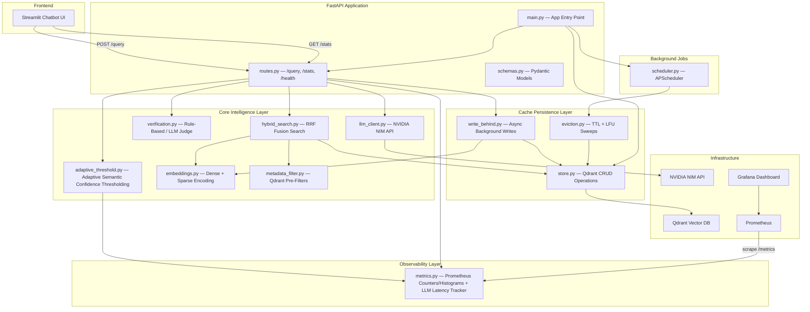
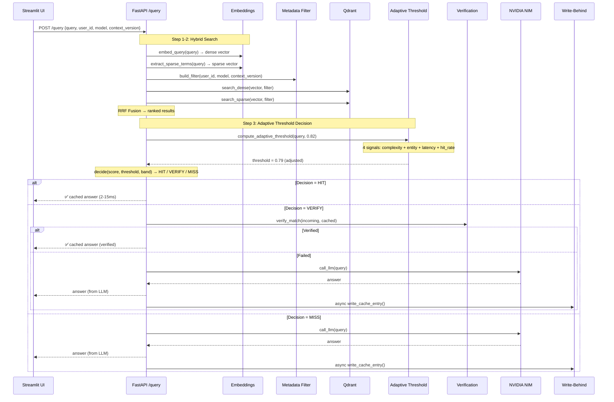
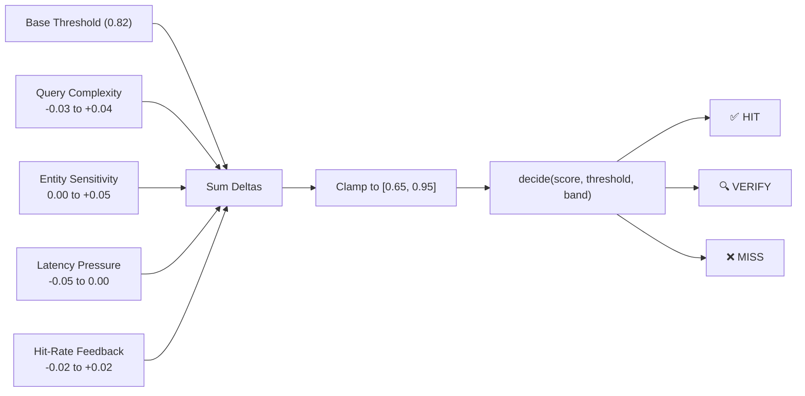

# Semantic Embedding Cache — Project Architecture

## High-Level System Architecture



---

## Request Flow — POST /query Pipeline



---

## Directory Structure

```
semantic-cache/
├── app/
│   ├── main.py                        # FastAPI app, lifespan, CORS, Prometheus
│   ├── config.py                      # Pydantic Settings (env vars, thresholds)
│   │
│   ├── api/                           # ── API Layer ──
│   │   ├── routes.py                  # POST /query, GET /stats, GET /health
│   │   └── schemas.py                 # QueryRequest, QueryResponse, StatsResponse
│   │
│   ├── core/                          # ── Intelligence Layer ──
│   │   ├── adaptive_threshold.py      # 4-signal adaptive thresholding + decide()
│   │   ├── hybrid_search.py           # Dense + Sparse search with RRF fusion
│   │   ├── embeddings.py              # all-MiniLM-L6-v2 dense + TF sparse
│   │   ├── verification.py            # Rule-based & LLM-judge verify
│   │   ├── metadata_filter.py         # Qdrant pre-filter builder
│   │   └── llm_client.py              # NVIDIA NIM API wrapper
│   │
│   ├── cache/                         # ── Persistence Layer ──
│   │   ├── store.py                   # Qdrant client, upsert, search, hit tracking
│   │   ├── write_behind.py            # Async background cache writes
│   │   └── eviction.py                # TTL expiry + LFU eviction sweeps
│   │
│   ├── jobs/                          # ── Background Jobs ──
│   │   └── scheduler.py              # APScheduler: TTL (6h), LRU (24h)
│   │
│   └── monitoring/                    # ── Observability ──
│       └── metrics.py                 # Prometheus metrics + LLM latency tracker
│
├── chatbot/
│   └── streamlit_app.py               # Streamlit chat UI
│
├── eval/
│   └── run_eval.py                    # Precision/recall evaluation harness
│
├── tests/
│   ├── unit/                          # Pure logic tests (no Docker)
│   │   ├── test_adaptive_threshold.py # 29 tests — adaptive + decide()
│   │   ├── test_threshold.py          # 19 tests — decide() boundaries
│   │   └── test_eviction.py           # Eviction logic tests
│   └── integration/                   # Requires Docker (testcontainers)
│       └── test_cache_pipeline.py     # End-to-end cache pipeline
│
├── docker/
│   └── Dockerfile                     # API container
├── docker-compose.yml                 # Full stack: API + Qdrant + Prometheus + Grafana
├── monitoring/
│   ├── prometheus.yml                 # Scrape config
│   └── grafana/                       # Dashboard provisioning
├── loadtest/
│   └── locustfile.py                  # Load testing with Locust
│
├── .env / .env.example                # Environment variables
└── requirements.txt                   # Python dependencies
```

---

## Module Responsibilities

| Layer | Module | Responsibility |
|---|---|---|
| **API** | [`routes.py`](file:///d:/semantic%20Caching/app/api/routes.py) | Orchestrates the full query pipeline, records metrics |
| **API** | [`schemas.py`](file:///d:/semantic%20Caching/app/api/schemas.py) | Pydantic request/response validation |
| **Core** | [`adaptive_threshold.py`](file:///d:/semantic%20Caching/app/core/adaptive_threshold.py) | 4-signal adaptive threshold + HIT/VERIFY/MISS decision gate |
| **Core** | [`hybrid_search.py`](file:///d:/semantic%20Caching/app/core/hybrid_search.py) | Dense + sparse dual search fused via RRF |
| **Core** | [`embeddings.py`](file:///d:/semantic%20Caching/app/core/embeddings.py) | all-MiniLM-L6-v2 dense vectors + TF sparse terms |
| **Core** | [`verification.py`](file:///d:/semantic%20Caching/app/core/verification.py) | Rule-based token overlap + LLM judge for borderline hits |
| **Core** | [`metadata_filter.py`](file:///d:/semantic%20Caching/app/core/metadata_filter.py) | Qdrant pre-filter: tenant isolation, model scoping, TTL, versioning |
| **Core** | [`llm_client.py`](file:///d:/semantic%20Caching/app/core/llm_client.py) | NVIDIA NIM OpenAI-compatible API wrapper |
| **Cache** | [`store.py`](file:///d:/semantic%20Caching/app/cache/store.py) | Qdrant CRUD: collection init, upsert, search, hit tracking |
| **Cache** | [`write_behind.py`](file:///d:/semantic%20Caching/app/cache/write_behind.py) | Non-blocking background cache writes on miss |
| **Cache** | [`eviction.py`](file:///d:/semantic%20Caching/app/cache/eviction.py) | Periodic TTL expiry + LFU-based eviction |
| **Jobs** | [`scheduler.py`](file:///d:/semantic%20Caching/app/jobs/scheduler.py) | APScheduler: TTL sweep (6h) + LRU sweep (24h) |
| **Monitoring** | [`metrics.py`](file:///d:/semantic%20Caching/app/monitoring/metrics.py) | Prometheus counters/histograms + rolling LLM latency tracker |
| **Config** | [`config.py`](file:///d:/semantic%20Caching/app/config.py) | Pydantic Settings: thresholds, connections, feature flags |

---

## Infrastructure Services

| Service | Technology | Port | Purpose |
|---|---|---|---|
| API Server | FastAPI | `8000` | Cache-or-call pipeline |
| Vector DB | Qdrant | `6333` | Dense + sparse vector storage |
| LLM | NVIDIA NIM | External | Nemotron-3 chat completions |
| Metrics | Prometheus | `9090` | Metric scraping & storage |
| Dashboard | Grafana | `3000` | Hit-rate, latency, similarity charts |
| Chat UI | Streamlit | `8501` | User-facing chatbot interface |

---

## Adaptive Threshold — Signal Flow


