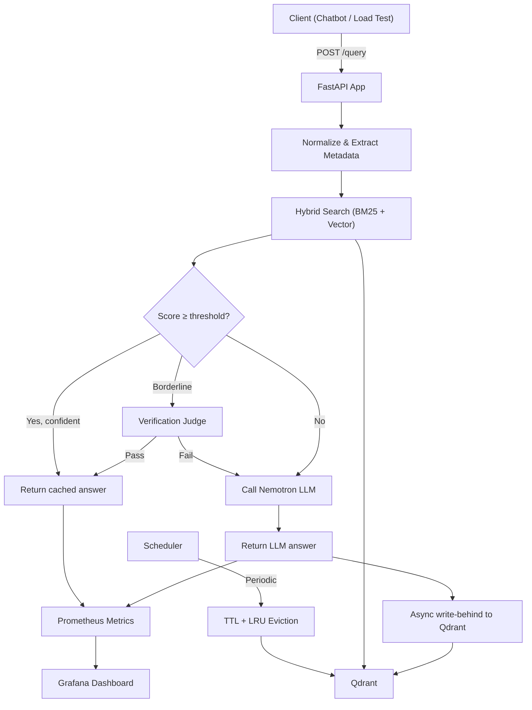

# Semantic Embedding Cache — Implementation Plan

A caching layer that sits in front of an LLM API (NVIDIA Nemotron via NIM) to cut cost and latency by detecting *semantically similar* queries using hybrid retrieval (dense + sparse), metadata scoping, borderline verification, and full Prometheus/Grafana observability.

---

## User Review Required

> [!IMPORTANT]
> **NVIDIA API Key** — You'll need a valid NVIDIA NIM API key (`NVIDIA_API_KEY`) set in `.env`. The free tier has rate limits, which is actually part of the project's value prop (cache = quota saver).

> [!IMPORTANT]
> **Frontend choice** — The spec mentions "Streamlit or React." I'll default to **Streamlit** for faster iteration. Let me know if you want React instead.

> [!IMPORTANT]
> **Docker requirement** — The full stack (Qdrant, Prometheus, Grafana) runs via Docker Compose. Confirm Docker Desktop is available on your machine.

## Open Questions

> [!NOTE]
> **Initial similarity threshold** — The spec says to determine via eval harness, not guess. I'll start with `0.82` as the default and a tolerance band of `±0.05` for the verification zone, then let the eval sweep calibrate it.

> [!NOTE]
> **Verification strategy** — Should borderline hits use the same Nemotron model (costs a free-tier API call) or a rule-based overlap check (free, faster)? I'll implement **both** behind a config flag, defaulting to rule-based to conserve quota.

---

## Architecture Overview



---

## Proposed Changes

The project is built from scratch. I'll follow the spec's suggested build order, organized into **6 phases**.

---

### Phase 1 — Project Skeleton & Core Embedding/Storage

Set up the project structure, configuration, and the fundamental embed → store → retrieve pipeline.

#### [NEW] [`requirements.txt`](file:///D:/semantic%20Caching/requirements.txt)
Dependencies:
- `fastapi`, `uvicorn[standard]` — API layer
- `openai` — NVIDIA NIM client (OpenAI-compatible)
- `sentence-transformers` — `all-MiniLM-L6-v2` embedding
- `qdrant-client` — Qdrant vector DB client
- `prometheus-client`, `prometheus-fastapi-instrumentator` — metrics
- `pydantic`, `pydantic-settings` — config/schemas
- `python-dotenv` — env loading
- `httpx` — async HTTP for load tests
- `streamlit` — chatbot UI
- `pandas` — eval harness
- `apscheduler` — periodic eviction jobs
- `testcontainers` — integration test fixtures
- `pytest`, `pytest-asyncio` — testing

#### [NEW] [`.env.example`](file:///D:/semantic%20Caching/.env.example)
Template with all configurable environment variables:
- `NVIDIA_API_KEY`, `NVIDIA_BASE_URL`, `NVIDIA_MODEL`
- `QDRANT_HOST`, `QDRANT_PORT`, `QDRANT_COLLECTION`
- `SIMILARITY_THRESHOLD`, `VERIFICATION_BAND`, `VERIFICATION_MODE`
- `CACHE_TTL_SECONDS`, `CACHE_MAX_SIZE`
- `EMBEDDING_MODEL_NAME`

#### [NEW] [`app/config.py`](file:///D:/semantic%20Caching/app/config.py)
Pydantic `Settings` class loading all env vars with sensible defaults. Single source of truth for thresholds, model names, Qdrant connection, etc.

#### [NEW] [`app/core/embeddings.py`](file:///D:/semantic%20Caching/app/core/embeddings.py)
- Load `all-MiniLM-L6-v2` via `sentence-transformers` (singleton, lazy init)
- `embed_query(text: str) -> list[float]` — returns dense vector
- `extract_sparse_terms(text: str) -> dict[str, float]` — simple tokenize + TF weighting for BM25-style sparse representation

#### [NEW] [`app/cache/store.py`](file:///D:/semantic%20Caching/app/cache/store.py)
- Qdrant client wrapper: `init_collection()`, `upsert_entry()`, `search()`
- Collection created with **both** dense and sparse vector indices
- Payload schema: `query_text`, `answer`, `user_id`, `model`, `context_version`, `expires_at`, `last_accessed_at`, `created_at`

---

### Phase 2 — Hybrid Search, Metadata Filtering & Threshold Logic

The differentiating retrieval layer — this is what makes the cache "semantic" rather than exact-match.

#### [NEW] [`app/core/hybrid_search.py`](file:///D:/semantic%20Caching/app/core/hybrid_search.py)
- `hybrid_search(query, metadata_filters, top_k) -> list[ScoredResult]`
- Issues both dense and sparse queries to Qdrant
- Fuses results via **Reciprocal Rank Fusion (RRF)**: `score = Σ 1/(k + rank)` across dense and sparse result lists
- Alternatively supports weighted `α·dense + (1-α)·sparse` (config-driven)

#### [NEW] [`app/core/metadata_filter.py`](file:///D:/semantic%20Caching/app/core/metadata_filter.py)
- `build_filter(user_id, model, context_version) -> QdrantFilter`
- Constructs Qdrant `Filter` with `must` conditions
- Filters applied **pre-retrieval** (passed into search, not post-processed)
- Also filters `expires_at > now` to skip expired entries at query time

#### [NEW] [`app/core/threshold.py`](file:///D:/semantic%20Caching/app/core/threshold.py)
- `decide(score, threshold, band) -> "hit" | "miss" | "verify"`
- Clear three-way decision: confident hit, confident miss, or borderline requiring verification
- Pure function, easily unit-testable

#### [NEW] [`app/core/verification.py`](file:///D:/semantic%20Caching/app/core/verification.py)
- `verify_match(original_query, cached_query, cached_answer) -> bool`
- **Rule-based mode**: token overlap ratio, entity/number exact-match check
- **LLM-judge mode**: short Nemotron prompt asking "Are these queries asking the same thing?"
- Mode selected via `VERIFICATION_MODE` config

---

### Phase 3 — LLM Client, Write-Behind & Eviction

Complete the miss path and cache lifecycle management.

#### [NEW] [`app/core/llm_client.py`](file:///D:/semantic%20Caching/app/core/llm_client.py)
- `call_llm(query, model) -> str`
- Uses `openai.OpenAI` client with `base_url=https://integrate.api.nvidia.com/v1`
- Model: `nvidia/nemotron-3-ultra-550b-a55b`
- Retry logic with exponential backoff for rate limits

#### [NEW] [`app/cache/write_behind.py`](file:///D:/semantic%20Caching/app/cache/write_behind.py)
- `async_cache_write(query, answer, embedding, sparse_terms, metadata)`
- Uses FastAPI `BackgroundTasks` to write to Qdrant without blocking the response
- Generates UUID for point ID, attaches all metadata payload fields

#### [NEW] [`app/cache/eviction.py`](file:///D:/semantic%20Caching/app/cache/eviction.py)
- `evict_expired()` — scroll + delete where `expires_at < now`
- `evict_lru(max_size)` — if collection count > max, delete by oldest `last_accessed_at`
- Both are idempotent, safe to run on schedule

#### [NEW] [`app/jobs/scheduler.py`](file:///D:/semantic%20Caching/app/jobs/scheduler.py)
- APScheduler background scheduler started on FastAPI `lifespan`
- Runs `evict_expired()` every 5 minutes, `evict_lru()` every 15 minutes

---

### Phase 4 — API Layer, Monitoring & Docker Compose

Wire everything into endpoints, instrument with Prometheus, and containerize.

#### [NEW] [`app/api/schemas.py`](file:///D:/semantic%20Caching/app/api/schemas.py)
Pydantic models:
- `QueryRequest`: `query`, `user_id`, `model` (optional), `context_version` (optional)
- `QueryResponse`: `answer`, `source` ("cache" | "llm"), `latency_ms`, `similarity_score` (optional)
- `StatsResponse`: session hit rate, total queries, cache size

#### [NEW] [`app/api/routes.py`](file:///D:/semantic%20Caching/app/api/routes.py)
- `POST /query` — the main endpoint orchestrating the full flow:
  1. Normalize query text
  2. Embed (dense + sparse)
  3. Build metadata filter
  4. Hybrid search in Qdrant
  5. Threshold decision → hit / verify / miss
  6. If hit or verified: update `last_accessed_at`, return cached
  7. If miss: call LLM, return answer, schedule write-behind
- `GET /stats` — JSON stats for chatbot sidebar
- `GET /health` — liveness check

#### [NEW] [`app/main.py`](file:///D:/semantic%20Caching/app/main.py)
- FastAPI app with lifespan (init Qdrant collection, start scheduler)
- Mount routes
- `PrometheusInstrumentator` auto-instruments all endpoints

#### [NEW] [`app/monitoring/metrics.py`](file:///D:/semantic%20Caching/app/monitoring/metrics.py)
Custom Prometheus metrics:
- `cache_hits_total` (Counter)
- `cache_misses_total` (Counter)
- `cache_verifications_total` (Counter, label: `result=pass|fail`)
- `cache_hit_latency_seconds` (Histogram)
- `cache_miss_latency_seconds` (Histogram)
- `llm_calls_saved_total` (Counter) — the "requests saved from quota" metric
- `cache_size` (Gauge)
- `similarity_score_distribution` (Histogram)

#### [NEW] [`docker/Dockerfile`](file:///D:/semantic%20Caching/docker/Dockerfile)
- Python 3.11 slim base
- Install requirements, copy app code
- `CMD ["uvicorn", "app.main:app", "--host", "0.0.0.0", "--port", "8000"]`

#### [NEW] [`docker-compose.yml`](file:///D:/semantic%20Caching/docker-compose.yml)
Four services:
- `app` — built from `docker/Dockerfile`, exposes 8000, depends on qdrant
- `qdrant` — `qdrant/qdrant:latest`, port 6333, volume for persistence
- `prometheus` — `prom/prometheus:latest`, port 9090, mounts `monitoring/prometheus.yml`
- `grafana` — `grafana/grafana:latest`, port 3000, mounts dashboards + provisioning

#### [NEW] [`monitoring/prometheus.yml`](file:///D:/semantic%20Caching/monitoring/prometheus.yml)
Scrape config targeting `app:8000/metrics` every 5s.

#### [NEW] [`monitoring/grafana/provisioning/datasources/prometheus.yml`](file:///D:/semantic%20Caching/monitoring/grafana/provisioning/datasources/prometheus.yml)
Auto-provision Prometheus as Grafana data source.

#### [NEW] [`monitoring/grafana/provisioning/dashboards/dashboard.yml`](file:///D:/semantic%20Caching/monitoring/grafana/provisioning/dashboards/dashboard.yml)
Auto-provision the cache dashboard JSON.

#### [NEW] [`monitoring/grafana/dashboards/cache_dashboard.json`](file:///D:/semantic%20Caching/monitoring/grafana/dashboards/cache_dashboard.json)
Pre-built Grafana dashboard with panels:
- Hit rate over time (gauge + time series)
- Latency percentiles split by hit/miss
- Cache size gauge
- LLM calls saved counter
- Similarity score distribution histogram

---

### Phase 5 — Testing & Evaluation

#### [NEW] [`tests/unit/test_threshold.py`](file:///D:/semantic%20Caching/tests/unit/test_threshold.py)
- Hit above threshold, miss below, verify in band
- Edge cases at exact boundary values

#### [NEW] [`tests/unit/test_rrf_fusion.py`](file:///D:/semantic%20Caching/tests/unit/test_rrf_fusion.py)
- RRF math correctness with known rank lists

#### [NEW] [`tests/unit/test_metadata_filter.py`](file:///D:/semantic%20Caching/tests/unit/test_metadata_filter.py)
- Filter construction with various combinations of user_id/model/context_version

#### [NEW] [`tests/unit/test_eviction.py`](file:///D:/semantic%20Caching/tests/unit/test_eviction.py)
- TTL selection logic, LRU ordering

#### [NEW] [`tests/integration/conftest.py`](file:///D:/semantic%20Caching/tests/integration/conftest.py)
- `testcontainers-python` fixture spinning up real Qdrant per test run

#### [NEW] [`tests/integration/test_cache_pipeline.py`](file:///D:/semantic%20Caching/tests/integration/test_cache_pipeline.py)
- Write → paraphrase query → cache hit
- Unrelated query → cache miss
- Expired TTL → not served
- Multi-tenant isolation (user A ≠ user B)

#### [NEW] [`eval/datasets/paraphrase_pairs.json`](file:///D:/semantic%20Caching/eval/datasets/paraphrase_pairs.json)
~30-50 pairs of semantically equivalent queries (should hit). Examples:
- "What's the weather today?" / "How's the weather looking today?"
- "Explain quantum computing" / "Can you describe what quantum computing is?"

#### [NEW] [`eval/datasets/near_miss_pairs.json`](file:///D:/semantic%20Caching/eval/datasets/near_miss_pairs.json)
~30-50 pairs that embed similarly but have different intent (should NOT hit). Examples:
- "Q1 2024 revenue" / "Q1 2023 revenue"
- "Python list append" / "Python list extend"

#### [NEW] [`eval/run_eval.py`](file:///D:/semantic%20Caching/eval/run_eval.py)
- Sweep thresholds (0.70 → 0.95, step 0.01)
- At each threshold: compute precision (correct hits / total hits) and recall (correct hits / should-hit pairs)
- Output precision-recall curve, recommend optimal threshold
- Save results to `eval/results/`

---

### Phase 6 — Chatbot UI, Load Testing & README

#### [NEW] [`chatbot/streamlit_app.py`](file:///D:/semantic%20Caching/chatbot/streamlit_app.py)
- Chat interface hitting `POST /query`
- Per-message badge: "⚡ Cache Hit (12ms)" or "🔄 LLM Call (1.8s)"
- Sidebar: live session hit rate, total queries, cache size (polled from `/stats`)
- Metadata inputs: user_id, model selector, context_version

#### [NEW] [`loadtest/generate_queries.py`](file:///D:/semantic%20Caching/loadtest/generate_queries.py)
- Generate realistic query corpus with the spec's traffic mix:
  - ~25% exact repeats
  - ~35% paraphrases
  - ~40% novel queries

#### [NEW] [`loadtest/run_load_test.py`](file:///D:/semantic%20Caching/loadtest/run_load_test.py)
- Fire 2,000+ async requests via `httpx.AsyncClient`
- Record per-request: latency, source (hit/miss), similarity score
- Save raw results to JSON

#### [NEW] [`loadtest/analyze_results.py`](file:///D:/semantic%20Caching/loadtest/analyze_results.py)
- Compute: hit-rate convergence curve, p50/p95/p99 latency by hit/miss, total cost savings
- Generate the headline sentence for the README

#### [NEW] [`README.md`](file:///D:/semantic%20Caching/README.md)
- Architecture diagram (mermaid)
- Headline numbers from load test
- Quick start (`docker-compose up`)
- Tech stack table
- Testing & eval instructions

---

## Verification Plan

### Automated Tests

```bash
# Unit tests (no external deps)
pytest tests/unit/ -v

# Integration tests (requires Docker for testcontainers)
pytest tests/integration/ -v

# Eval harness (requires running Qdrant)
python eval/run_eval.py
```

### Manual Verification

1. **Full stack smoke test**: `docker-compose up` → hit `/query` via curl → confirm response + Prometheus metrics update → Grafana panels populate
2. **Cache hit verification**: Send same query twice → second should return `source: "cache"` with lower latency
3. **Multi-tenant isolation**: Send identical query with different `user_id` → should NOT cross-cache
4. **Eviction**: Insert entry with short TTL → wait → query again → should miss
5. **Chatbot UI**: Open Streamlit → chat → verify badges show hit/miss correctly and sidebar stats update live
6. **Load test**: Run `run_load_test.py` → verify Grafana shows real-time metrics → check `analyze_results.py` output matches expected patterns
7. **Grafana dashboard**: Confirm auto-provisioned on `docker-compose up`, panels show data, auto-refresh works

---

## Build Order Summary

| Phase | What Gets Built | Depends On |
|-------|----------------|------------|
| **1** | Skeleton, config, embeddings, Qdrant store | Nothing |
| **2** | Hybrid search, metadata filter, threshold, verification | Phase 1 |
| **3** | LLM client, write-behind, eviction, scheduler | Phases 1-2 |
| **4** | API routes, Prometheus metrics, Docker Compose, Grafana | Phases 1-3 |
| **5** | Unit tests, integration tests, eval harness | Phases 1-4 |
| **6** | Streamlit chatbot, load test, README | Phases 1-5 |

Estimated total: **~40-50 files**, built incrementally with tests at each phase.
