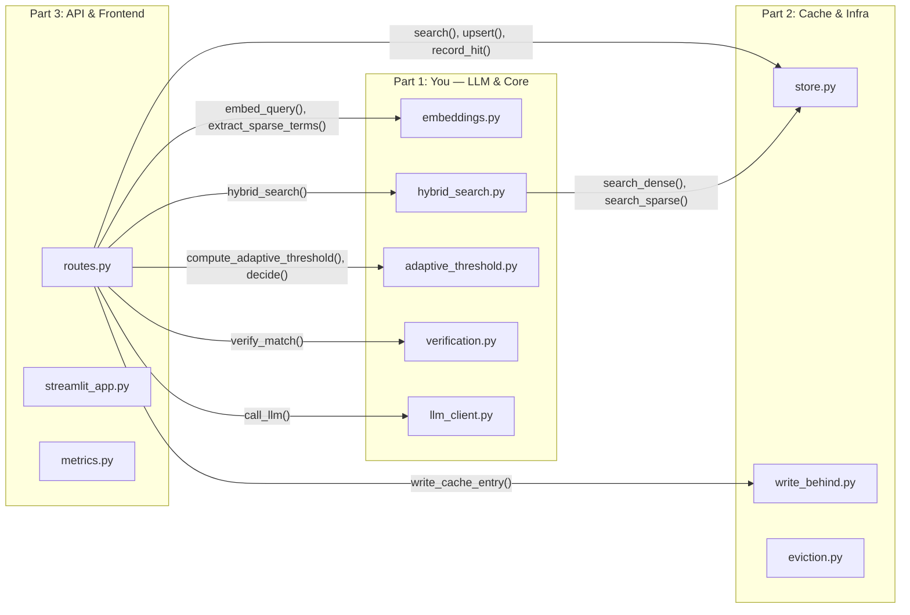

# Semantic Cache — 3-Way Work Division

The project splits naturally into **3 independent layers** that map 1:1 onto team members. Each part is roughly equal in effort and has clean interface boundaries.

---

## 🔵 Part 1 — You (Prajwal): LLM & Core Intelligence Layer

> *The "brain" — everything that reasons about queries, computes similarity, and decides HIT/VERIFY/MISS.*

### Files You Own

| File | What It Does |
|------|-------------|
| [`llm_client.py`](file:///d:/semantic%20Caching/app/core/llm_client.py) | NVIDIA NIM API wrapper, retry logic, token tracking |
| [`embeddings.py`](file:///d:/semantic%20Caching/app/core/embeddings.py) | Dense embeddings (MiniLM-L6-v2) + sparse TF term extraction |
| [`adaptive_threshold.py`](file:///d:/semantic%20Caching/app/core/adaptive_threshold.py) | 4-signal adaptive threshold (complexity, entity, latency, hit-rate) + `decide()` gate |
| [`hybrid_search.py`](file:///d:/semantic%20Caching/app/core/hybrid_search.py) | Dense + sparse dual search with RRF fusion |
| [`verification.py`](file:///d:/semantic%20Caching/app/core/verification.py) | Rule-based token overlap + LLM judge for borderline hits |
| [`metadata_filter.py`](file:///d:/semantic%20Caching/app/core/metadata_filter.py) | Qdrant pre-filter builder (tenant, model, version) |

### Tests You Own

| File | Coverage |
|------|----------|
| [`test_adaptive_threshold.py`](file:///d:/semantic%20Caching/tests/unit/test_adaptive_threshold.py) | 29 tests — adaptive threshold signals |
| [`test_threshold.py`](file:///d:/semantic%20Caching/tests/unit/test_threshold.py) | 19 tests — HIT/VERIFY/MISS decision boundaries |
| [`test_rrf_fusion.py`](file:///d:/semantic%20Caching/tests/unit/test_rrf_fusion.py) | RRF fusion ranking |
| [`test_metadata_filter.py`](file:///d:/semantic%20Caching/tests/unit/test_metadata_filter.py) | Metadata filter construction |

### Evaluation

| File | Purpose |
|------|---------|
| [`eval/run_eval.py`](file:///d:/semantic%20Caching/eval/run_eval.py) | Precision/recall evaluation harness |
| [`eval/datasets/`](file:///d:/semantic%20Caching/eval/datasets) | Evaluation datasets |

### Your Key Responsibilities
- Embedding model selection and tuning
- Hybrid search ranking quality (RRF weights)
- Adaptive threshold signal design and calibration
- Verification accuracy (rule-based + LLM judge)
- Evaluation metrics (precision, recall, hit-rate)

---

## 🟢 Part 2 — Friend 2: Cache Persistence & Infrastructure Layer

> *The "storage engine" — everything that stores, retrieves, expires, and manages cached data in Qdrant + Docker.*

### Files They Own

| File | What It Does |
|------|-------------|
| [`store.py`](file:///d:/semantic%20Caching/app/cache/store.py) | Qdrant client, collection init, upsert, search, hit-count tracking |
| [`write_behind.py`](file:///d:/semantic%20Caching/app/cache/write_behind.py) | Async background cache writes on MISS |
| [`eviction.py`](file:///d:/semantic%20Caching/app/cache/eviction.py) | TTL expiry + LFU-based eviction sweeps |
| [`scheduler.py`](file:///d:/semantic%20Caching/app/jobs/scheduler.py) | APScheduler: TTL sweep (6h), LRU sweep (24h) |
| [`config.py`](file:///d:/semantic%20Caching/app/config.py) | Pydantic Settings — all env vars, thresholds, feature flags |

### Infrastructure Files They Own

| File | What It Does |
|------|-------------|
| [`docker-compose.yml`](file:///d:/semantic%20Caching/docker-compose.yml) | Full stack: API + Qdrant + Prometheus + Grafana |
| [`Dockerfile`](file:///d:/semantic%20Caching/docker/Dockerfile) | API container image |
| [`.env.example`](file:///d:/semantic%20Caching/.env.example) | Environment variable template |
| [`requirements.txt`](file:///d:/semantic%20Caching/requirements.txt) | Python dependencies |

### Tests They Own

| File | Coverage |
|------|----------|
| [`test_eviction.py`](file:///d:/semantic%20Caching/tests/unit/test_eviction.py) | Eviction logic tests |
| [`test_cache_pipeline.py`](file:///d:/semantic%20Caching/tests/integration/test_cache_pipeline.py) | End-to-end integration (testcontainers) |
| [`conftest.py`](file:///d:/semantic%20Caching/tests/integration/conftest.py) | Integration test fixtures |

### Their Key Responsibilities
- Qdrant collection schema and CRUD operations
- Write-behind async strategy
- Eviction policies (TTL + LFU tuning)
- Background scheduler configuration
- Docker setup, container networking, deployment
- Environment config management

---

## 🟠 Part 3 — Friend 3: API, Frontend & Monitoring Layer

> *The "interface" — everything the user touches, the API orchestration, and system observability.*

### Files They Own

| File | What It Does |
|------|-------------|
| [`routes.py`](file:///d:/semantic%20Caching/app/api/routes.py) | FastAPI endpoints: POST `/query`, GET `/stats`, GET `/health` — **orchestrates the entire pipeline** |
| [`schemas.py`](file:///d:/semantic%20Caching/app/api/schemas.py) | Pydantic request/response models |
| [`main.py`](file:///d:/semantic%20Caching/app/main.py) | FastAPI app entry, lifespan events, CORS, Prometheus mount |
| [`streamlit_app.py`](file:///d:/semantic%20Caching/chatbot/streamlit_app.py) | Streamlit chatbot UI |

### Monitoring Files They Own

| File | What It Does |
|------|-------------|
| [`metrics.py`](file:///d:/semantic%20Caching/app/monitoring/metrics.py) | Prometheus counters, histograms, LLM latency tracker |
| [`prometheus.yml`](file:///d:/semantic%20Caching/monitoring/prometheus.yml) | Prometheus scrape config |
| [`grafana/`](file:///d:/semantic%20Caching/monitoring/grafana) | Grafana dashboard provisioning & JSON dashboards |

### Load Testing They Own

| File | What It Does |
|------|-------------|
| [`locustfile.py`](file:///d:/semantic%20Caching/loadtest/locustfile.py) | Locust load testing script |

### Shared Documentation

| File | What It Does |
|------|-------------|
| [`README.md`](file:///d:/semantic%20Caching/README.md) | Project README |
| [`architecture.md`](file:///d:/semantic%20Caching/architecture.md) | Architecture docs |

### Their Key Responsibilities
- API endpoint design, error handling, response formatting
- Request/response schema validation
- Pipeline orchestration logic in `routes.py`
- Streamlit chatbot UI/UX
- Prometheus metrics instrumentation
- Grafana dashboards
- Load testing & performance benchmarking
- Documentation

---

## Interface Contracts Between Parts

This is how the three parts connect — agree on these interfaces early and you can work in parallel:

### Key Function Signatures to Agree On

| From → To | Function | Signature |
|-----------|----------|-----------|
| Routes → You | `embed_query` | `(text: str) → list[float]` |
| Routes → You | `extract_sparse_terms` | `(text: str) → dict[str, float]` |
| Routes → You | `call_llm` | `(query: str) → tuple[str, dict]` |
| Routes → You | `compute_adaptive_threshold` | `(query: str, base: float) → float` |
| Routes → You | `decide` | `(score, threshold, band) → "HIT" \| "VERIFY" \| "MISS"` |
| Routes → You | `verify_match` | `(incoming: str, cached: str) → bool` |
| Routes → Friend 2 | `store.search()` | `(vector, filter, limit) → list[ScoredPoint]` |
| Routes → Friend 2 | `store.upsert()` | `(query, answer, vector, metadata) → None` |
| Routes → Friend 2 | `write_behind.write_cache_entry()` | `(query, answer, metadata) → None` |

---

## Effort Comparison

| Part | Files | Lines of Code (approx) | Tests |
|------|-------|----------------------|-------|
| 🔵 Part 1 — You (LLM/Core) | 6 source + 4 test + eval | ~39,000 bytes | 48+ unit tests |
| 🟢 Part 2 — Cache/Infra | 5 source + 2 test + Docker | ~20,700 bytes | Integration + unit |
| 🟠 Part 3 — API/Frontend/Monitoring | 5 source + load test + Grafana | ~22,500 bytes | Load tests + manual |

> [!TIP]
> Part 1 (yours) has the most algorithmic complexity. Part 2 has infrastructure/DevOps work. Part 3 has the most integration/orchestration work plus UI. This makes the overall effort roughly balanced.
